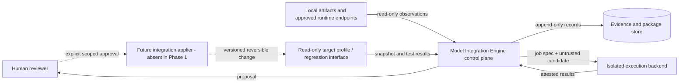
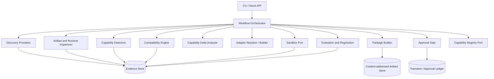
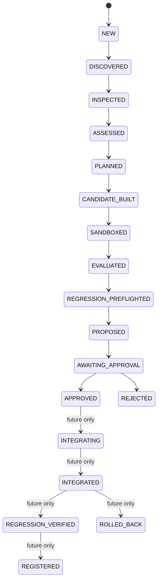

# Model Integration Engine — Architecture Specification

**Document status:** Phase 1 baseline
**Architecture version:** 0.1.0
**Scope:** standalone engine; no SAGE modification or integration
**Primary design style:** evidence-first hexagonal architecture with append-only workflow records

## 1. Purpose

The Model Integration Engine (MIE) turns an unknown model resource into a reviewable, evidence-backed **integration proposal**. It discovers resources, inspects them without executing untrusted model code, evaluates capabilities through controlled probes, determines compatibility with an immutable target profile, selects or proposes adapters, and packages all findings for human approval.

The engine does not make a model “part of SAGE” by itself. In the current phase it has no write path to SAGE at all.

## 2. Goals and non-goals

### 2.1 Goals

- Add runtimes, artifact formats, inspectors, detectors, evaluators, and adapters through plugins.
- Keep model-family details in inspected data and declarative profiles.
- Preserve raw observations and derivation provenance behind every capability assessment.
- Distinguish model behavior from runtime/API affordances and integration behavior.
- Prefer reusable protocol adapters over generated code.
- Treat generation, inspection, evaluation, approval, and application as separate trust stages.
- Resume after recoverable failures without repeating already committed observations.
- Produce immutable, content-addressed packages suitable for review, signing, and rollback planning.
- Work offline/local-first; any network access is explicit and policy-scoped.

### 2.2 Non-goals for Phase 1

- Modifying, importing, or running SAGE.
- Executing a consequential integration.
- Downloading models automatically.
- Executing model repository code such as `trust_remote_code`.
- Implementing a production-grade container or microVM sandbox.
- Claiming that the first validation model has any capability before local evidence exists.
- Extracting “knowledge” from weights or assuming it transfers into SAGE.

## 3. Architectural principles

1. **Ports over family branches.** Core orchestration selects plugins from descriptors and support predicates. It never dispatches on a model name.
2. **Observations before conclusions.** Inspectors emit typed observations. Detectors create claims. Evaluators validate claims. No single component silently promotes its own inference.
3. **Subject-scoped claims.** A claim names its subject: model, artifact, deployment, runtime, adapter, tool, skill, knowledge asset, integration, or target system.
4. **Open-world semantics.** Missing evidence means `UNKNOWN`, not `NOT_SUPPORTED`.
5. **Multiple evidence can conflict.** Raw evidence is retained; policy computes a current assessment without deleting contradictions.
6. **Content identity over labels.** Runtime tags and filenames are aliases. Digests, manifests, runtime instance identity, and deployment bindings provide durable identity.
7. **Read-only by default.** Discovery and inspection may read approved locations/endpoints. Writes go only to the engine workspace/evidence store until an independently approved future application stage.
8. **Generated code is untrusted.** It cannot run outside a sandbox, approve itself, or modify the engine or target.
9. **Approval is scope-bound.** Approval covers a package digest, proposed-change digest, target-profile digest, permissions, and policy version. A material change invalidates it.
10. **Reversibility is a deliverable.** A proposal without a concrete rollback plan is incomplete.
11. **No silent self-modification.** Contract or policy changes require a versioned migration and review like any other architecture change.
12. **Offline-first.** Core tests and inspections require no internet. Remote enrichment is optional, separately labeled provider evidence.

## 4. Domain boundaries

These concepts must not be collapsed:

| Entity | Meaning | Example (not a special case) |
|---|---|---|
| `ModelIdentity` | Logical model/revision identity | A revision described by metadata and digests |
| `Artifact` | Bytes or directory manifest | GGUF file, model directory |
| `ModelDeployment` | A runtime-specific binding | Runtime instance + runtime model reference |
| `RuntimeInstance` | Process/service that loads models | A local Ollama service |
| `RuntimeCapability` | Feature the runtime/API exposes | Streaming transport, schema parameter |
| `ModelCapability` | Behavior attributable to model inference | Instruction following under a defined profile |
| `Adapter` | Protocol/representation bridge | Normalized chat request to runtime API |
| `Tool` | External operation a model may request | Calculator contract |
| `Skill` | Orchestration/prompt/tool composition | Bounded summarization workflow |
| `KnowledgeAsset` | Provenanced informational asset | Licensed corpus or retrieval index |
| `IntegrationCapability` | End-to-end ability after composition | Reliable schema-constrained response via adapter |
| `TargetCapability` | Capability already available to target | Entry from a read-only target snapshot |

A runtime accepting a `tools` field is a runtime capability. A model emitting a correct tool call is model behavior. Correct end-to-end dispatch through an adapter is an integration capability. They require different evidence.

## 5. System context and trust zones



### Trust zones

- **Zone A — core control plane:** trusted orchestrator, policy, schemas, and evidence logic.
- **Zone B — source boundary:** model bytes, metadata, templates, and runtime responses are untrusted input.
- **Zone C — generation boundary:** generated source/configuration is untrusted.
- **Zone D — sandbox:** least-privilege execution with declared controls and disposable state.
- **Zone E — target boundary:** read-only in this phase. A future applier is a separate component and credential set.
- **Zone F — approval boundary:** human decision over immutable scope; not an LLM decision.

## 6. Logical architecture



### 6.1 Layering

- **Domain:** immutable identities, observations, claims, assessments, risks, approvals, transitions.
- **Application:** workflow use cases and policy evaluation. Depends only on domain and ports.
- **Ports:** discovery, inspection, runtime, sandbox, evaluation, package, registry, and target-profile contracts.
- **Plugins/infrastructure:** Ollama, GGUF, local-directory, container/microVM, stores, CLI. These depend inward.

Core dependency direction is one-way. Plugins register descriptors such as supported resource kinds, formats, protocols, and operations. Plugin selection uses those descriptors—not model names.

## 7. Directory and module structure

The repository begins contract-first and grows without changing the dependency direction:

```text
model-integration-engine/
├── README.md
├── pyproject.toml
├── docs/
│   ├── architecture-specification.md
│   ├── component-contracts.md
│   ├── data-models.md
│   ├── security-and-approval.md
│   ├── test-strategy.md
│   ├── qwen3-ollama-validation-plan.md
│   └── decisions/
├── schemas/
│   ├── integration-package.schema.json
│   ├── capability-registry.schema.json
│   └── examples/
├── src/model_integration_engine/
│   ├── domain.py                  # Phase-1 reference value types
│   ├── contracts.py               # Phase-1 ports
│   ├── application/               # Future orchestration/policy
│   ├── plugins/
│   │   ├── discovery/             # ollama, filesystem, future runtimes
│   │   ├── inspectors/            # gguf, model-directory, runtime
│   │   ├── adapters/              # protocol adapters, not family adapters
│   │   ├── evaluators/
│   │   └── sandboxes/
│   └── infrastructure/            # stores, CLI, telemetry
├── tests/
├── validation/                    # Named validation fixtures/plans only
└── reports/
```

The `validation/qwen3-4b-ollama` directory may name the first test case. No Qwen reference may appear under `src/` unless it is data supplied at runtime.

## 8. Workflow and state machine



Every transition is append-only and records:

- run and transition ID
- prior and next stage
- input/output digests
- policy version
- actor type and identifier
- timestamp
- evidence IDs
- structured failure, if any

A failed job emits partial immutable outputs and a retry token. Retry uses an idempotency key derived from stage, subject digest, configuration digest, and policy version. Non-equivalent retry inputs create a new run.

### 8.1 Regression ordering

The requirements imply both “before integration” and “after integration” regression checks. MIE uses two gates:

1. **Preflight regression:** compare current baseline with the candidate in a staging/sandbox profile before approval or application.
2. **Post-application verification:** after a future approved atomic application, rerun smoke and affected regressions. Failure triggers the documented rollback path.

No approved write occurs before preflight.

## 9. Subsystems

### 9.1 Model discovery

A discovery provider emits resource observations for one or more resource kinds:

- runtime instance
- model deployment
- artifact
- local model directory

Initial providers:

- **Ollama provider:** probe version, list local model references, capture runtime digestable identity, and bind each tag/digest to a deployment.
- **Filesystem artifact provider:** discover candidate GGUF files under explicitly approved roots, respecting recursion, file-count, byte-read, symlink, and timeout limits.
- **Model-directory provider:** identify directories from safe marker/manifests without importing code.

Discovery is non-destructive. It does not pull, delete, copy, create, or run models. Runtime aliases are never considered sufficient model identity.

The Ollama API documents `GET /api/version`, `GET /api/tags`, and `POST /api/show`; list responses include model names, sizes, digests, format/family labels, parameter size, and quantization level, while show responses can include template, capabilities, and `model_info` metadata.[1][2][3]

### 9.2 Artifact and runtime inspection

Inspectors advertise the media/resource types and safe operations they support. Multiple inspectors may contribute findings to one subject.

**GGUF inspector** reads only:

- magic/version/header counts
- key/value metadata
- tensor names, shapes, offsets, and storage types
- tokenizer fields and special-token identifiers
- embedded chat templates
- architecture namespace and hyperparameters
- quantization metadata and observed tensor type distribution
- shard/sidecar relationships where discoverable

It does not load tensor data into an inference engine. GGUF is explicitly extensible and key/value based, so unknown fields are preserved verbatim rather than discarded.[4]

**Local-directory inspector** uses an allowlist of parsers for JSON, text, tokenizer, safetensors headers, and manifest formats. Pickle, Python, shell, shared libraries, and repository-defined loaders are never executed during inspection.

**Runtime inspector** gathers endpoint/version/schema observations and model details. A runtime claim is scoped to the observed runtime version and endpoint configuration.

An inspection finding records raw value, normalized value, source locator, source digest, collector version, and any parse warning. Aggregation cannot overwrite a conflicting finding; it creates a contradiction set.

### 9.3 Capability detection

Detectors map findings to candidate claims. Claims have:

- capability key (namespaced, e.g. `generation.text`)
- capability class (`MODEL_CAPABILITY`, `RUNTIME_CAPABILITY`, etc.)
- explicit subject
- support state
- validation state
- evidence IDs and evidence levels
- parameters/limits
- contradictions and limitations

Evidence levels are:

- `DETECTED_FROM_METADATA`
- `DETECTED_FROM_RUNTIME`
- `VALIDATED_BY_TEST`
- `INFERRED`
- `UNKNOWN`
- `NOT_SUPPORTED`

The support state is separate: `SUPPORTED`, `PARTIAL`, `NOT_SUPPORTED`, `UNKNOWN`, or `CONFLICTING`. This avoids treating “no metadata field” as a negative result. `NOT_SUPPORTED` requires affirmative negative evidence. `VALIDATED` requires at least one passing test evidence record bound to the tested subject and environment.

Provider documentation may seed a hypothesis, but it remains provider evidence—not local validation. A detector cannot promote its own `INFERRED` claim to `VALIDATED`.

### 9.4 Compatibility engine

Compatibility is computed against a versioned, immutable `TargetSystemProfile`; no SAGE source access is required. The profile describes required and optional contracts:

- accepted protocols and transports
- normalized input/output shape
- role and template requirements
- tokenizer/counting expectations
- context minimum and reserved budget
- modalities
- tool-call and result-message semantics
- structured-output contract
- streaming/event semantics
- cancellation, timeout, and failure mapping
- privacy/locality restrictions
- resource envelope
- required permissions

Each requirement is `SATISFIED`, `SATISFIED_WITH_ADAPTER`, `UNSATISFIED`, or `UNKNOWN`, with evidence. Overall results are:

- `COMPATIBLE`
- `COMPATIBLE_WITH_ADAPTER`
- `INCOMPATIBLE`
- `UNKNOWN`

Unknown mandatory requirements prevent a compatibility pass. Policy version and target-profile digest are part of the assessment.

### 9.5 Capability delta

The delta analyzer compares only like-for-like claims under a common evaluation profile:

- `ADDED`: validated candidate capability absent from the baseline
- `IMPROVED`: statistically/policy-significant improvement on a comparable measure
- `REDUNDANT`: no meaningful new capability
- `REGRESSED`: candidate or integration harms an existing measure
- `UNKNOWN`: evidence is not comparable or incomplete

Marketing labels, model size, and architecture names are not capability deltas. Knowledge is never declared transferable unless a separate knowledge artifact, license, provenance chain, extraction mechanism, and evaluation exist.

### 9.6 Adapter engine

Adapter resolution is ordered:

1. Reuse an existing protocol adapter.
2. Configure an existing adapter with a model/deployment profile.
3. Compose existing transport, template, and output-normalization components.
4. Generate the smallest missing component.
5. Declare incompatibility/unknown if safe generation or validation is impossible.

Adapters are layered:

- **Transport adapter:** HTTP/IPC/process interaction.
- **Runtime protocol adapter:** maps normalized operations to a runtime API.
- **Deployment profile:** selected template, roles, stop conditions, modalities, and limits.
- **Output normalizer:** text, structured data, tool-call, usage, finish/failure mapping.
- **Target binding:** target-specific interface, deferred until SAGE integration work is explicitly approved.

A generic Ollama adapter should serve many model deployments. Family-specific behavior belongs in discovered/configured profiles only when evidence requires it.

Every candidate records origin (`EXISTING`, `CONFIGURED`, `COMPOSED`, `GENERATED`), source/config digests, permissions, trust status, and validation status. Generated candidates begin `UNTRUSTED`.

### 9.7 Capability/component extraction

Extraction produces separate inventories:

- model behavior claims
- runtime/API claims
- reusable tools
- reusable skills/workflows
- knowledge assets
- end-to-end integration claims

“Extraction” may mean a declarative configuration, interface binding, or evaluated skill—not copying weights or hidden knowledge. Any generated tool or skill follows the same untrusted-code path as an adapter.

### 9.8 Sandbox

The sandbox port accepts a content-addressed job and returns an attested result. Required policy controls are declared, then the backend reports which were actually enforced:

- read-only candidate and test mounts
- ephemeral writable workspace
- no target/SAGE filesystem mount
- no host package manager or privileged device access
- no network by default; explicit endpoint allowlist when runtime access is necessary
- CPU, memory, disk, process, and time limits
- non-root identity
- syscall/capability restrictions where supported
- output/log size limits
- secret-free environment or scoped secret broker
- cleanup and post-run host-write verification

MIE must not call a backend “isolated” merely because it uses a subprocess. Missing required controls is a blocker recorded in evidence.

### 9.9 Evaluation

Evaluations are versioned suites with deterministic fixtures where possible. They test:

- health and basic inference
- instruction following
- reasoning outcome (not private chain-of-thought quality)
- structured output and JSON Schema conformance
- tool-call selection and arguments, using non-consequential fake tools
- streaming and cancellation
- context handling and truncation behavior
- reliability over repeated trials
- latency and token throughput, labeled with environment
- malformed requests, timeout, unavailable model, and partial-stream failures
- adapter normalization and target compatibility

A test result stores prompt/fixture digest, parameters, seed if supported, sanitized outputs or output digest, parser result, timing, runtime/model/deployment identity, environment, and suite version. Evaluation thresholds live in policy, not detector code.

### 9.10 Integration package

The package is an immutable review artifact containing identity, artifacts, runtime, inspections, claims, evidence, compatibility, delta, adapter/configuration, sandbox runs, evaluations, regressions, risks, permissions, proposed changes, rollback, approval state, assumptions, and limitations.

The normative schema is `schemas/integration-package.schema.json`. Large binaries, logs, and patches are referenced by content digest instead of embedded. Secrets and raw credentials are forbidden.

A package is finalized by canonical serialization and hashing. Approval is stored as a separate ledger event referencing that digest to avoid self-referential hashes.

### 9.11 Approval gate

Allowed before approval:

`DISCOVER -> INSPECT -> ANALYZE -> GENERATE -> TEST -> EVALUATE -> PROPOSE`

Not allowed before explicit scoped approval:

- target writes
- active registration
- credential expansion
- network or filesystem permission expansion
- installation or execution outside the sandbox

Approval can be `APPROVE`, `REJECT`, or `REQUEST_CHANGES`. A changed package, target snapshot, permissions set, proposed change set, or policy invalidates prior approval.

### 9.12 Regression testing

Regression selection combines:

- mandatory baseline suite
- adapter/protocol contract suite
- affected capability tests from the proposed-change graph
- security and permission tests
- tests previously associated with touched files/interfaces

The report distinguishes baseline failures, candidate failures, flaky/inconclusive results, added capabilities, affected tests, and unchanged functions. A regression pass is evidence bound to exact baseline and candidate digests.

### 9.13 Capability registry

The registry contains approved, active, validated deployment capabilities. Each registered capability references:

- model, artifact, runtime, deployment, and adapter identity
- integration package digest
- validation test/evidence IDs
- constraints and environment
- approval event
- health status and last check
- rollback/deactivation reference

Inferred or unknown claims may remain in integration packages, but cannot appear as active validated registry capabilities. Registry writes occur only after approval and successful post-application regression in the future application phase.

## 10. Evidence resolution policy

Evidence is append-only and may disagree. The resolver:

1. Groups evidence by exact subject, capability key, test/profile, and material environment dimensions.
2. Rejects stale/mismatched subject identity.
3. Preserves positive and negative observations.
4. Marks unresolved disagreement `CONFLICTING`.
5. Allows `VALIDATED` only when required tests pass and policy thresholds are met.
6. Downgrades to `UNKNOWN` when evidence is stale, incomplete, or incomparable.
7. Never converts an inference into metadata/runtime/test evidence.

Evidence “strength” is not a universal scalar. A metadata record may be authoritative for tensor shape while a behavioral test is authoritative for output reliability.

## 11. Identity and provenance

### 11.1 Identity rules

- Artifact identity: cryptographic digest plus size; a directory uses a canonical manifest digest.
- Runtime identity: runtime kind, reported version, endpoint identity, and deployment-local instance ID.
- Deployment identity: runtime identity + runtime model reference + runtime-provided model digest.
- Logical model identity: explicit upstream revision where proven; otherwise an engine-generated provisional ID linked to artifact/deployment digests.
- Adapter/config identity: canonical source/config manifest digest.
- Evaluation identity: suite version + fixture digest + parameters + subject/environment digests.

A label such as `name:tag` is an alias. It may be moved and therefore never anchors historical evidence by itself.

### 11.2 Provenance minimum

Every material finding records `who/what collected it`, `when`, `from where`, `using which collector version`, `against which digest`, and `how it was transformed`. Derived evidence lists parent evidence IDs and the deterministic rule/policy version.

## 12. Failure and recovery model

All operations return either a typed result or a structured problem:

- stable error code and stage
- retryable flag
- affected subject
- sanitized cause
- partial output/evidence IDs
- suggested remediation
- cleanup status

Examples include `RUNTIME_UNREACHABLE`, `FORMAT_UNSUPPORTED`, `INSPECTION_LIMIT_EXCEEDED`, `TEMPLATE_PARSE_FAILED`, `SANDBOX_CONTROL_UNAVAILABLE`, `TEST_TIMEOUT`, `EVIDENCE_CONFLICT`, and `APPROVAL_SCOPE_CHANGED`.

Partial discovery and inspection are valid artifacts with an incomplete status. Workflows can resume from the last digest-matching transition. Cleanup failures are high-severity evidence, not log-only warnings.

## 13. Versioning and reversibility

- Schemas use semantic versions and explicit migration tools.
- Plugin contracts expose their own version and compatibility range.
- Policies, test suites, target profiles, and registries are versioned inputs.
- Proposed changes include a write set, preconditions, patch/config artifacts, application order, and inverse/restore plan.
- Future application must use staging plus transactional or atomic replacement where the target supports it.
- An integration can be disabled without deleting historical evidence.
- Engine architecture changes are normal reviewed releases; the engine never rewrites its own contracts based on model output.

## 14. Initial vertical slice boundary

The first implementation after this architecture will support:

- discovery of one approved Ollama endpoint
- discovery of local model deployments through documented read-only endpoints
- inspection via model details and GGUF-derived metadata exposed by the runtime
- generic claim creation with evidence levels
- a generic Ollama normalized chat adapter
- sandboxed, non-consequential inference probes
- compatibility against a synthetic target profile
- a draft integration package

It will not:

- modify SAGE
- auto-pull a model
- execute generated code on the host
- claim untested capabilities
- activate the capability registry
- apply an integration

The named first case lives only in the validation fixture. Passing it must not add a family branch.

## 15. Acceptance criteria for Phase 1

- All ten requested architecture deliverables exist.
- JSON Schemas pass Draft 2020-12 metaschema checks.
- Example integration package and registry documents validate.
- Schema tests reject a validated inference with no test evidence.
- Schema tests reject incomplete approval and unvalidated active registry capability.
- Reference interfaces import without optional runtime dependencies.
- Core source contains no model-specific or SAGE-specific behavior.
- Assumptions and unverified facts are explicitly listed.

## 16. Traceability to core objectives

| Objective | Owning subsystem/artifact |
|---|---|
| Discover model/runtime | Discovery providers |
| Identify artifact/format | Discovery + artifact inspectors |
| Metadata/architecture/tokenizer/template | Inspection reports |
| Modalities/capabilities | Detectors + evaluators + evidence |
| Runtime/API capabilities | Runtime inspector + protocol probes |
| Compatibility | Target profile + compatibility engine |
| Required adapters/tools/skills | Delta + adapter/component planner |
| Contributed capabilities | Capability delta |
| Generate/configure adapter | Adapter engine, untrusted candidate |
| Isolated tests/evaluation | Sandbox + evaluation framework |
| Evidence report/package | Evidence store + integration package |
| Regression | Two-stage regression runner |
| Explicit approval | Scope-bound approval gate |
| Registration | Post-approval registry port, future only |

## 17. References

1. Ollama, [Get version API](https://docs.ollama.com/api-reference/get-version.md).
2. Ollama, [List models API](https://docs.ollama.com/api/tags.md).
3. Ollama, [Show model details API](https://docs.ollama.com/api-reference/show-model-details.md).
4. ggml project, [GGUF specification](https://github.com/ggml-org/ggml/blob/master/docs/gguf.md).
5. Ollama, [Chat API](https://docs.ollama.com/api/chat.md).
