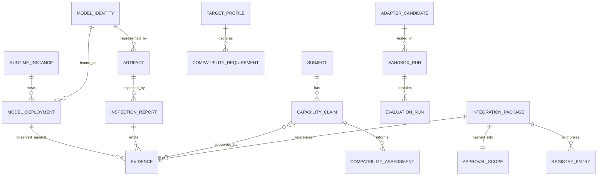

# Data Models and Semantics

This document defines the conceptual model. JSON Schema is normative for persisted integration packages and the registry; Python dataclasses are a reference for in-process contracts.

## 1. Entity relationship model



## 2. Identity models

### 2.1 `SubjectRef`

A stable reference containing:

- `kind`: model, artifact, runtime, deployment, adapter, tool, skill, knowledge, integration, target
- `subject_id`: engine-assigned URI-like identifier
- `version` or revision, if proven
- `digest`, when content-addressable

Claims and evidence always carry a subject reference. They never rely on a display name.

### 2.2 `ModelIdentity`

| Field | Meaning |
|---|---|
| `model_id` | Stable engine ID; provisional if upstream revision is unknown |
| `names` | Aliases/display names, non-authoritative |
| `publisher` | Proven publisher or null |
| `upstream_uri` | Proven source URI or null |
| `revision` | Immutable upstream revision if observed |
| `architecture_label` | Observed metadata value, not capability |
| `artifact_ids` | Artifacts representing this identity |
| `identity_basis` | Evidence IDs and reconciliation method |

A new digest under an existing mutable tag creates a new deployment/artifact identity. Reconciliation may link it to the same logical model revision only with evidence.

### 2.3 `ArtifactDescriptor`

- artifact ID and format
- URI/path reference (package-safe and sanitized)
- SHA-256 or stronger digest; directory manifest digest
- size and file count
- media type
- shard/sidecar/base relationships
- trust state
- read-only observation flag
- evidence IDs

A directory manifest canonicalizes relative path, file type, size, and digest. It excludes caches and follows symlink policy.

### 2.4 `RuntimeInstance`

- runtime ID, kind, and version
- endpoint identity and locality (`LOCAL`, `LAN`, `REMOTE`, `UNKNOWN`)
- API/protocol versions
- authentication **reference**, never secret material
- configuration fingerprint where observable and allowed
- evidence IDs

### 2.5 `ModelDeployment`

- deployment ID
- runtime ID
- model ID or provisional model reference
- runtime model reference/tag
- runtime-provided artifact/model digest
- loaded/running state as a timestamped observation
- active runtime options/profile digest

Behavioral evidence is normally deployment-scoped because runtime, quantization, template, and options can alter behavior.

## 3. Inspection models

### 3.1 `InspectionFinding`

| Field | Meaning |
|---|---|
| `path` | Namespaced key such as `general.architecture` |
| `raw_value` | Safely decoded source value |
| `normalized_value` | Optional normalized representation |
| `value_type` | Source type |
| `source` | Locator, digest, byte/range or JSON pointer |
| `evidence_level` | Usually metadata or runtime detection |
| `warnings` | Parse/coercion/truncation warnings |
| `evidence_id` | Immutable supporting record |

### 3.2 `InspectionReport`

- report and inspector identity/version
- exact subject and input digest
- requested/completed inspection levels
- start/completion timestamps
- findings and unknown fields
- contradictions
- completeness (`COMPLETE`, `PARTIAL`, `FAILED`)
- structured problem and evidence references

“Partial” is not failure concealment; consumers must explicitly decide whether missing findings block later stages.

## 4. Evidence model

### 4.1 `EvidenceRecord`

Required data:

- globally unique evidence ID
- evidence kind (`METADATA_FIELD`, `RUNTIME_OBSERVATION`, `TEST_RESULT`, `STATIC_ANALYSIS`, `PROVIDER_DOCUMENT`, `USER_INPUT`, `DERIVATION`)
- evidence level
- exact subject
- machine-readable claim/observation key
- observed value or digest/reference
- source locator and source digest
- collector ID/version
- collection timestamp
- environment ID for runtime/test evidence
- outcome for tests/probes
- parent evidence IDs for derivations
- redaction/retention metadata

Evidence records state observations. Capability claims state the current interpretation.

### 4.2 Evidence levels

| Level | Semantics | Can independently produce validated capability? |
|---|---|---|
| `DETECTED_FROM_METADATA` | Read from artifact/provider/runtime metadata | No |
| `DETECTED_FROM_RUNTIME` | Observed endpoint/schema/runtime behavior | No, unless the capability itself is exactly the probed runtime behavior and policy records it as a test |
| `VALIDATED_BY_TEST` | Passing defined test under recorded profile | Yes, subject to policy and repeated-trial requirements |
| `INFERRED` | Derived hypothesis | No |
| `UNKNOWN` | No reliable conclusion | No |
| `NOT_SUPPORTED` | Affirmative negative observation under defined conditions | No positive capability; may validate a negative compatibility finding |

`NOT_SUPPORTED` is not created from absence. An unsupported API response, explicit metadata declaration, or repeated negative test can qualify when policy says so.

### 4.3 Conflicts and supersession

Evidence is never overwritten. A correction or newer observation may `supersede` another record, but both remain. A claim lists contradictory evidence IDs. A claim is `CONFLICTING` until policy resolves the exact scope.

## 5. Capability model

### 5.1 Capability classes

Exactly separated classes:

- `MODEL_CAPABILITY`
- `RUNTIME_CAPABILITY`
- `TOOL_CAPABILITY`
- `SKILL_CAPABILITY`
- `KNOWLEDGE_CAPABILITY`
- `INTEGRATION_CAPABILITY`

Target-system capabilities use a target subject and normally one of the appropriate component/integration classes; they are not copied into the model record.

### 5.2 `CapabilityClaim`

```text
claim_id
capability_key
capability_class
subject
support: SUPPORTED | PARTIAL | NOT_SUPPORTED | UNKNOWN | CONFLICTING
validation: UNVALIDATED | VALIDATED | FAILED | WAIVED
evidence_levels[]
evidence_ids[]
parameters{}
limitations[]
contradictions[]
policy_version
assessed_at
```

Suggested capability namespaces:

- `generation.text`
- `generation.embeddings`
- `reasoning.general`
- `instruction.following`
- `output.json`
- `output.schema_constrained`
- `tools.function_calling`
- `modality.vision.input`
- `modality.audio.input`
- `context.long`
- `task.coding`
- `task.planning`
- `task.classification`
- `task.summarization`
- `protocol.streaming`
- `failure.cancellation`

Keys describe behavior/contract, not brands. Parameters capture limits such as context tokens, input media types, schema subset, language, score, latency environment, or reliability.

### 5.3 Validation invariants

- `VALIDATED` implies support is `SUPPORTED` or `PARTIAL`.
- `VALIDATED` requires a `VALIDATED_BY_TEST` evidence level and resolvable passing test evidence.
- `INFERRED` alone cannot be `VALIDATED`.
- `UNKNOWN` cannot be `VALIDATED`.
- A waived claim is not equivalent to validated and is excluded from active registry capabilities by default.
- A claim about provider training data or marketing benchmarks does not prove local deployment behavior.

## 6. Architecture, tokenizer, and template models

These remain inspected descriptions, not hard-coded classes.

### `ArchitectureDescription`

- architecture identifier and source
- parameter count: declared, calculated, or unknown (with method)
- block/layer counts and tensor structure summary
- embedding/head/feed-forward dimensions where present
- expert/MoE properties where present
- context metadata and scaling parameters
- modality component/sidecar relationships
- quantization distribution
- unknown architecture-specific key/value bag

### `TokenizerDescription`

- tokenizer type/model
- vocabulary size and digest
- pre-tokenizer/normalizer type
- special token IDs and strings where safely available
- BOS/EOS addition settings
- merges/scores presence and digest instead of huge embedding
- tokenizer artifact references
- count/test vectors

### `TemplateDescription`

- template source/digest
- syntax/engine label
- supported roles inferred from static parse, labeled as inference until render tests
- named/default templates
- tool-call sections and special tokens
- static parse result
- safe render test result
- runtime/client ownership (prevents double templating)

A template is untrusted text. Static/render inspection must impose expansion and resource limits.

## 7. Compatibility models

### 7.1 `TargetSystemProfile`

- target ID/version/digest
- required normalized operations
- requirement list with severity
- protocol and data contracts
- resource/privacy/security constraints
- baseline capability snapshot digest
- regression suite reference

### 7.2 `RequirementAssessment`

- requirement ID and description
- mandatory flag
- status: `SATISFIED`, `SATISFIED_WITH_ADAPTER`, `UNSATISFIED`, `UNKNOWN`
- evidence IDs
- adapter obligations
- remediation
- risks

### 7.3 `CompatibilityAssessment`

- assessment ID
- exact model/deployment/runtime/adapter/target subjects
- overall status
- requirement assessments
- blockers and unknowns
- required permissions/resources
- policy version and timestamp

The assessment is invalidated if any bound identity digest changes.

## 8. Adapter models

### 8.1 `AdapterCandidate`

- adapter ID/version/interface contract
- origin: `EXISTING`, `CONFIGURED`, `COMPOSED`, `GENERATED`
- transport/runtime/profile/normalizer component references
- source and configuration manifest digests
- supported normalized operations
- declared limitations/degradation behavior
- requested permissions
- trust state: `TRUSTED_EXISTING`, `REVIEW_REQUIRED`, `UNTRUSTED_GENERATED`
- validation state and evidence IDs

### 8.2 `AdapterPlan`

Records search decisions: candidates considered, compatibility gaps, chosen disposition, rejected alternatives, generation boundaries, tests, risks, and rollback/removal plan.

Generated code does not become an adapter registration until review, sandbox, evaluation, approval, application, and regression all succeed.

## 9. Sandbox and evaluation models

### `EnvironmentSnapshot`

- OS/kernel/container/microVM/backend identifiers
- CPU/GPU/accelerator and memory summary
- runtime/version/config digest
- adapter/config digest
- network/mount policy
- relevant deterministic settings
- sanitized—no secrets or personal host paths

### `TestCaseResult`

- test/suite ID and version
- capability/requirement under test
- fixture and prompt digest
- parameters/seed
- outcome: `PASS`, `FAIL`, `INCONCLUSIVE`, `ERROR`, `SKIPPED`
- assertions and measurements
- output/log references or digests
- environment and subject identities
- timing and resource use
- evidence IDs

### `EvaluationRun`

- run ID and plan/suite digest
- subject/deployment/adapter
- sandbox run ID
- results
- aggregate metrics with sample counts
- policy verdict
- limitations and failures

Latency comparisons are invalid across materially different environment snapshots unless explicitly normalized.

## 10. Risk, permission, and change models

### `Risk`

- risk ID/category
- severity and likelihood
- affected subject/change
- evidence
- mitigation
- residual severity
- blocking flag

### `PermissionRequest`

- permission ID and exact scope
- purpose
- stage where needed
- required/optional
- duration
- data exposure
- mitigation

No wildcard network/filesystem permission should be emitted when a narrower scope is possible.

### `ProposedChange`

- change ID
- target component/path/interface
- operation (`ADD`, `UPDATE`, `REMOVE`, `REGISTER`, `CONFIGURE`)
- before/after digest
- patch/artifact reference
- reason and capability link
- preconditions
- reversible flag
- rollback step/reference
- affected tests

Phase 1 examples can contain proposed changes as data, but no component applies them.

## 11. Approval model

Approval is a ledger event separate from package content:

- decision and actor identity
- package digest
- proposed-change-set digest
- target-profile digest
- permission-set digest
- policy version
- timestamp/expiry
- conditions
- authentication/audit reference

The integration package contains approval **state and scope metadata**, but final signature/event storage is external. This avoids a package hash including its own signature.

## 12. Integration package model

`schemas/integration-package.schema.json` requires:

- engine/workflow identity
- model/artifact/runtime identity
- inspection reports
- claims and complete evidence set
- compatibility and delta
- adapter/configuration
- sandbox/evaluation/regression data
- risks and permission requests
- exact proposed changes and rollback
- approval state/scope
- provenance, assumptions, and limitations

Large artifacts are referenced by digest. A package cannot contain an active registry mutation.

## 13. Capability registry model

`schemas/capability-registry.schema.json` stores only post-approval active/disabled/revoked entries. Active capabilities must be `VALIDATED` and reference test evidence. Each entry binds the deployable composition:

`model + artifact + deployment + runtime + adapter + configuration + environment constraints`

This is the answerable unit for “what capabilities do I currently have?” A logical model alone is insufficient.

## 14. Data minimization

- Credentials are references, never values.
- Prompt/output retention is configurable; hashes and assertion summaries are preferred.
- Reasoning/thinking traces are not required to validate correct outcomes and should be omitted unless a test specifically needs a separately exposed channel.
- Absolute host paths are sanitized from portable packages.
- Licenses and source provenance remain attached to artifacts, knowledge assets, generated code, and evaluation fixtures.
